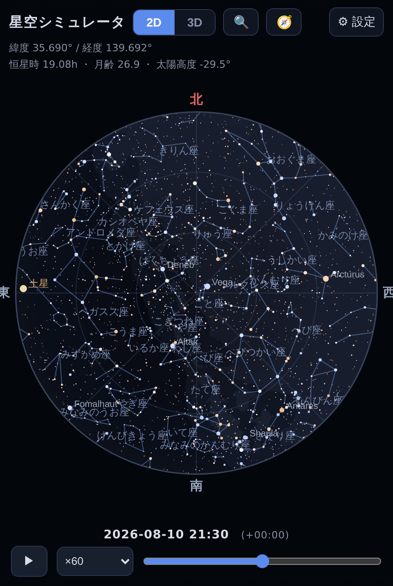
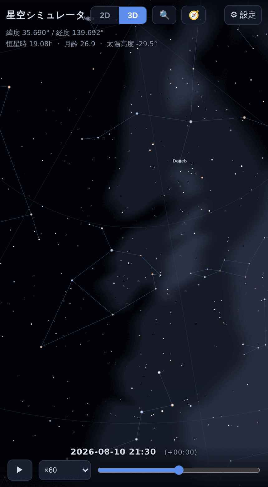
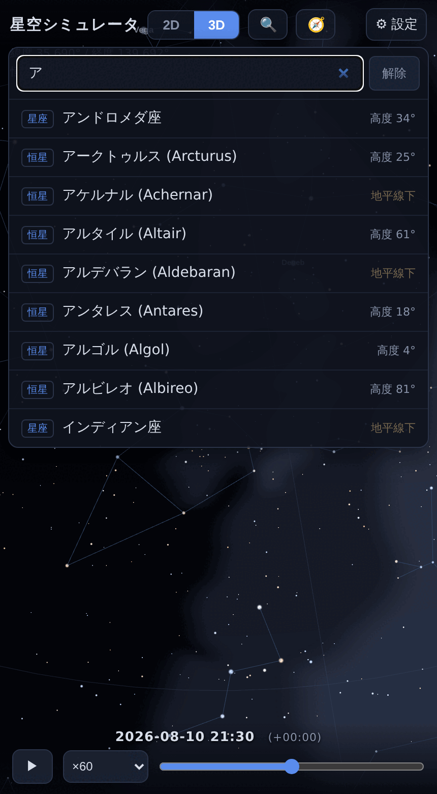
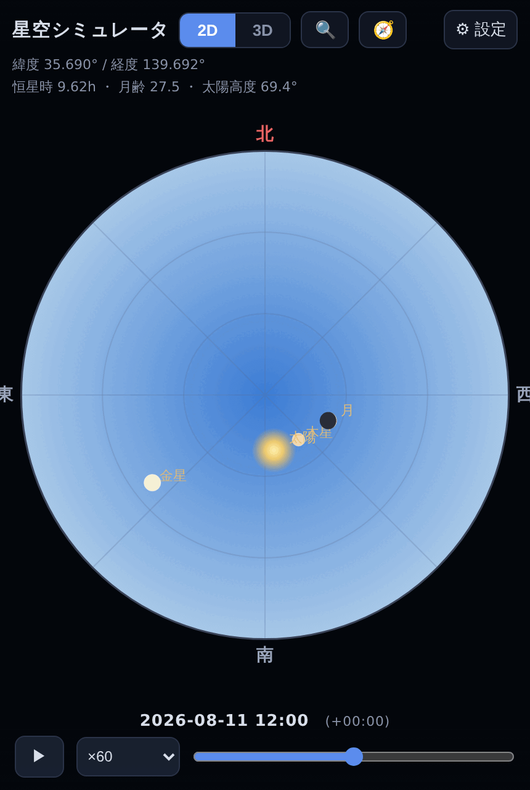

# hoshizora

[](https://github.com/sabas0ba/hoshizora/actions/workflows/ci.yml)
[](https://github.com/sabas0ba/hoshizora/actions/workflows/pages.yml)
[](LICENSE)

日時と緯度経度を指定して星空を表示する天体シミュレータ。
2D 星座早見と 3D プラネタリウムを切り替えられ、時刻の連続変化、天体検索、
端末の方位センサーとの連携に対応します。

**単一の HTML ファイルとして動作します。** 外部リソースを一切参照しないため、
ダウンロードすればオフラインでも利用できます。

**デモ: <https://sabas0ba.github.io/hoshizora/>**

| 2D 星座早見 | 3D プラネタリウム | 天体検索 | 昼間の空 |
|---|---|---|---|
|  |  |  |  |

## 特徴

- **2 種類のビュー**
  - 2D: 天頂を中心とする正距方位図法の全天図。北を上、東を左に配置した星座早見盤の形式
  - 3D: three.js による観測地点からのドームビュー
- **時刻の操作**: 基準日時 ±24 時間のスライダーと再生 (×1 〜 ×86400)。
  昼間に開いた場合はその日の 20:00 (観測地の時刻) の空を初期表示します
  (現在時刻に戻すボタンあり)
- **観測地の指定**: 緯度経度の直接入力、10 都市のプリセット、Geolocation API
- **URL による共有**: 日時・観測地・ビューを URL パラメータで指定でき、
  表示中の状態は URL にも反映されます (後述)
- **天体検索**: 恒星 (和名エイリアス対応)、星座 (和名・略符)、惑星、太陽、月、人工衛星。
  かな正規化つきの部分一致で、選択すると 2D はマーカー、3D は視線が対象へ移動します。
  画面外の対象には方向ガイドを表示します
- **方位センサー連携** (3D): 端末を向けた方向の空を表示します。
  iOS/Android のいずれにも対応し、方位のずれはドラッグで補正できます
- **表示の切り替え**: 星座線、星座名、恒星名、惑星、太陽・月、天の川、人工衛星、
  方位グリッド、地面、大気 (昼夜による空の色と星の減光)
- **描画対象**: 6.0 等までの恒星 5,070 個、88 星座の星座線、天の川、
  太陽・月 (満ち欠け)・惑星 7 個、人工衛星 3 基 (ISS・CSS・ハッブル) の軌跡と地球影判定

## 操作

| 操作 | 2D | 3D |
|---|---|---|
| 視点移動 | 拡大中にドラッグ | ドラッグ |
| 拡大・画角 | ピンチ / ホイール | ピンチ / ホイール |
| 天体の情報 | タップ | タップ |

ツールバーの 🔍 が検索、🧭 が方位センサー、⚙ が設定パネルです。

## URL パラメータ

日時と観測地を URL で指定して開けます。「この日のこの空」を 1 つのリンクで
渡せるほか、スクリーンショットの自動取得のように毎回同じ空を再現したい場合にも使えます。

```
https://sabas0ba.github.io/hoshizora/?t=2026-08-11T20:00%2B09:00&lat=35.690&lon=139.692
```

| パラメータ | 内容 | 例 |
|---|---|---|
| `t` | 基準日時。ISO 8601 | `2026-08-11T20:00+09:00`、`2026-08-11T11:00Z` |
| `lat` / `lon` | 観測地 (度) | `35.690` / `139.692` |
| `view` | 初期ビュー | `2d` / `3d` |

いずれも省略でき、省略時と不正値のときは既定の挙動 (現在日時または当夜 20:00、東京、2D)
になります。`t` は **UTC オフセットを付ける形式を推奨** します。省略するとブラウザの
タイムゾーンで解釈されるため、実行環境によって指す時刻が変わります。
URL に生の `+` を書くとクエリ文字列の復号で空白になりますが、
末尾のオフセットに限り補正して解釈します (`%2B` と書けば確実です)。

表示中の日時・観測地・ビューは `history.replaceState` で URL にも反映されるため、
アドレスバーをそのままコピーして共有できます。設定パネルの「この空の URL を作る」からも
同じ URL を取得できます。

**観測地の扱い**: 都市プリセット以外の座標 (「現在地を取得」と手入力) は、
自宅などの居場所である可能性があるため URL には自動では載せません。
共有ダイアログで注意書きとともに確認し、明示的に選んだ場合のみ含めます。
含めない場合、共有先では既定の観測地 (東京) で表示されます。
都市プリセットの座標と、URL パラメータで渡された座標
(すでにその URL に書かれているもの) はそのまま反映されます。

## ビルド

生成に必要なのは Python 3 のみです。同梱データはすべてリポジトリに含まれており、
ビルド時のネットワーク接続は不要です。

```sh
python3 tools/build_data.py   # data/ -> build/embedded_data.js
python3 tools/build_html.py   # -> dist/hoshizora.html (と Pages 用 index.html)
python3 tools/check_dist.py   # 生成物の静的検査
```

ブラウザでの動作確認には Node.js と Playwright が必要です。

```sh
npm install && npx playwright install --with-deps chromium
node tools/screenshot_test.js   # 2D/3D の表示とコンソールエラー
node tools/feature_test.js      # 検索と方位センサー (合成センサーイベント)
```

上流データの再取得と検証:

```sh
tools/fetch_sources.sh --verify   # 同梱データのハッシュ照合
tools/fetch_sources.sh            # 上流から再取得 (git, python3, bun が必要)
```

## リポジトリ構成

```
src/                アプリケーション本体
  astro.js            天文計算 (恒星時、太陽、月、惑星、大気差)
  app.js              2D/3D 描画、UI、検索、方位センサー
  style.css           スタイル
  index.template.html 埋め込み先テンプレート
data/               同梱データ (出典と条件は data/README.md)
vendor/             three.js r147, satellite.js 4.1.4 (バージョン固定)
tools/              ビルドと検証のスクリプト
docs/images/        README 用スクリーンショット
```

生成物 `dist/` はリポジトリに含めません。GitHub Actions がビルドし Pages へ配信します。

## 精度

表示用途に必要な水準を狙った略算であり、観測計画や精密計算には適しません。

| 対象 | 手法 | 概ねの誤差 | 検証 |
|---|---|---|---|
| 太陽 | Meeus 第 25 章 (低精度) | 0.01° 未満 | Meeus 例 25.a と照合 |
| 月 | Meeus 第 47 章 主要項 + 視差補正 | 0.3° 程度 | Meeus 例 47.a と照合 |
| 惑星 | Standish (JPL) 近似ケプラー要素 | 数分角 (1800–2050 年) | — |
| 恒星 | HYG v4.1 の J2000 位置 | 歳差・固有運動は未補正 | — |
| 人工衛星 | SGP4 (satellite.js) | TLE 元期から離れるほど増大 | — |

## 既知の制限

- **恒星の位置は J2000 元期のまま**です。歳差を補正していないため、
  現在から数百年離れた日時では 1° 程度ずれます。
- **人工衛星の TLE はスナップショット**です。元期は設定パネルに表示されます。
  とくに ISS は軌道維持を行うため、数日離れると位置が大きくずれます。
  最新化するには `tools/fetch_sources.sh` を実行してください。
- **航空機は表示しません。** リアルタイムの ADS-B データが必要であり、
  オフラインで完結する単一ファイルという方針と両立しないためです。
- **方位センサーは https 経由でのみ利用できる端末があります。**
  `file://` で開いた場合に許可を取得できないことがあるため、
  その場合は上記のデモ URL を利用してください。
- 大気差、視差、光行差の扱いは簡略化しています。日食・月食の予報には使えません。

## ライセンス

自作コード (`src/`, `tools/`) は [Apache License 2.0](LICENSE) です。

同梱するデータとライブラリにはそれぞれのライセンスが適用されます。
とくに恒星カタログは HYG Database に由来し **CC BY-SA 4.0 の継承対象** であるため、
生成物 `dist/hoshizora.html` を再配布する際は帰属表示と同一ライセンスでの提供が
必要になります。詳細は [THIRD-PARTY-NOTICES.md](THIRD-PARTY-NOTICES.md) を参照してください。

| 同梱物 | ライセンス |
|---|---|
| [HYG Database](https://github.com/astronexus/HYG-Database) v4.1 | CC BY-SA 4.0 |
| [d3-celestial](https://github.com/ofrohn/d3-celestial) のデータ | BSD 3-Clause |
| [CelesTrak](https://celestrak.org/) の TLE | 制限なし |
| [three.js](https://github.com/mrdoob/three.js) r147 | MIT |
| [satellite.js](https://github.com/shashwatak/satellite-js) 4.1.4 | MIT |
